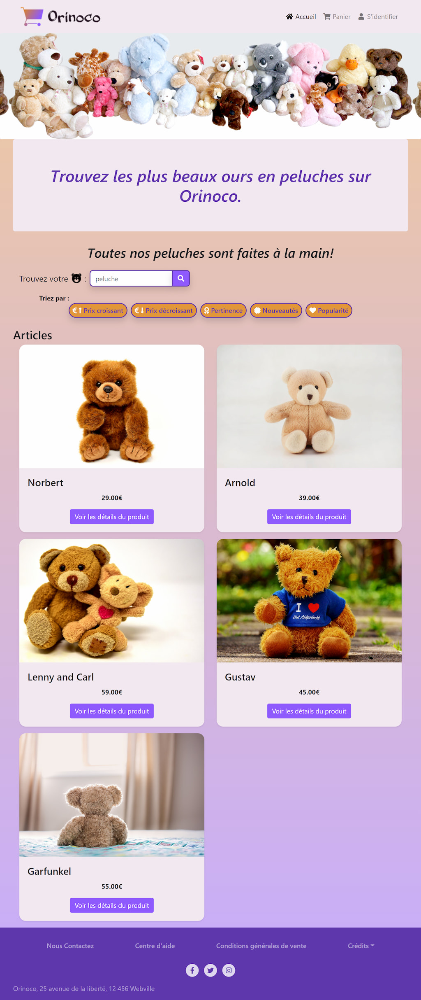

# Projet Orinoco

date de début: 30/12/2020

## Projet 5 du parcours développeur web d'Openclassrooms

### Objectif: Construisez un site de e-commerce

Créer la partie front-end du MVP d'un site de e-commerce Orinoco vendant des ours en peluche faits à la main. Le site doit pouvoir communiquer avec l'API backend disponible ici :

https://github.com/OpenClassrooms-Student-Center/JWDP5.git

L’application web est composée de **4 pages** :

- une page de vue sous forme de liste, montrant tous les articles disponibles à la vente ;
- une page “produit”, qui affiche l'article sélectionné par l'utilisateur, lui permet de personnaliser le produit et de l'ajouter à son panier ;
- une page “panier” contenant un résumé des produits dans le panier, le prix total et un formulaire permettant de passer une commande.
- une page de confirmation de commande, remerciant l'utilisateur pour sa commande, indiquant le prix total et le numéro de commande envoyé par le serveur.

Ce site est réalisé en utilisant les technologies _HTML, JavaScript pur_ pour le contenu des pages et la communication avec le serveur back-end et le _framework Bootstrap avec CSS_ pour la mise en page.

L'application est utilisable en clonant le répertoire back-end et en installant son application avec node.js, puis en consultant la page : https://marionlauzier.github.io/_5_30122020/

 
Aperçu de la page d'accueil:
     

